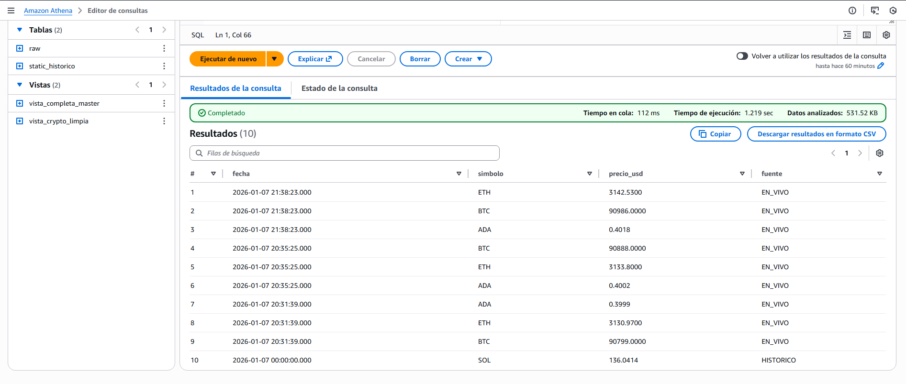
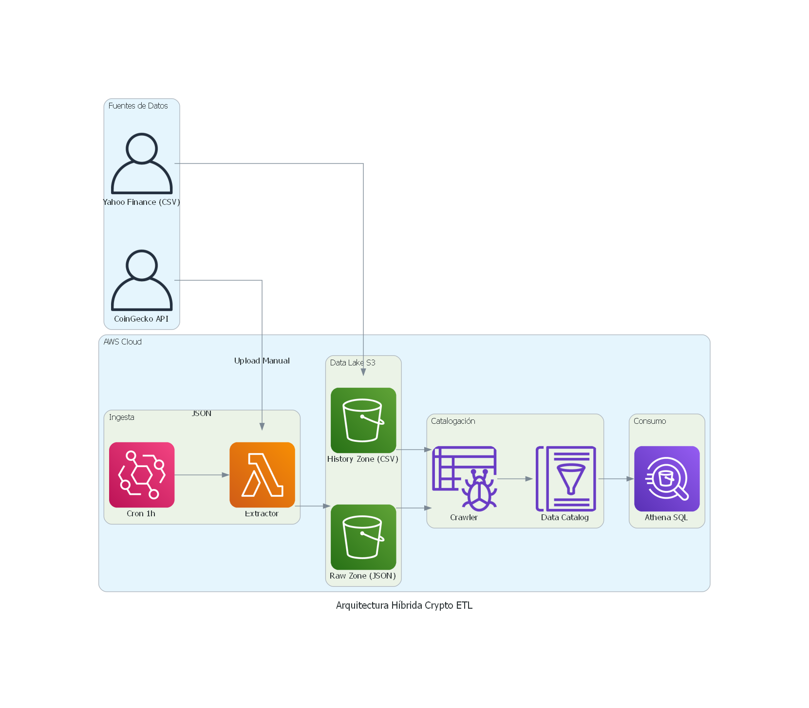

# 🚀 Hybrid Crypto Data Lake (AWS Serverless)

## 📋 Descripción del Proyecto

Este proyecto implementa una arquitectura de datos **híbrida** en AWS que unifica datos históricos financieros con un flujo de datos en tiempo real.

El objetivo es permitir análisis de tendencias a largo plazo (desde 2014) combinados con la volatilidad del minuto a minuto, todo bajo una infraestructura **Serverless** de bajo costo (AWS Free Tier).

## 🏗️ Arquitectura

El sistema maneja dos flujos de ingesta que convergen en una vista unificada:

### 1. Capa Batch (Histórica)

- **Fuente:** Extracción local masiva vía `yfinance` (Yahoo Finance API).
- **Ingesta:** Carga manual de archivos CSV a zona fría en S3.
- **Procesamiento:** AWS Glue Crawler para inferencia de esquema.

### 2. Capa Streaming (En Vivo)

- **Fuente:** API pública de CoinGecko.
- **Orquestación:** Amazon EventBridge (Cron cada 1 hora).
- **Compute:** AWS Lambda (Python) para extracción y volcado a S3.

### 3. Capa de Unificación y Consumo

- **Storage:** Amazon S3 (Data Lake con particionado lógico).
- **Serving Layer:** Amazon Athena (SQL) crea una "Super Vista" que normaliza y une ambos flujos mediante `UNION ALL`.

## 🛠️ Tecnologías

- **AWS Services:** Lambda, S3, Glue, Athena, EventBridge.
- **Lenguajes:** Python 3.12, SQL (Presto/Trino).
- **Librerías:** `boto3`, `pandas`, `yfinance`.

## 📂 Estructura del Repositorio

├── src/
│ ├── lambda_function.py # Extracción en tiempo real (AWS Lambda)
│ └── backfill_script.py # Script local para descarga histórica (Yahoo Finance)
├── sql/
│ ├── view_cleanup.sql # Limpieza de JSON en vivo
│ └── view_master.sql # Unificación (Live + Historic)
├── img/
│ └── architecture_diagram.png
└── README.md

## 📊 Resultados

La vista maestra permite consultar la historia completa sin distinción de la fuente de origen.

**Prueba de Unificación (Histórico + Vivo):**

**Arquitectura:**

